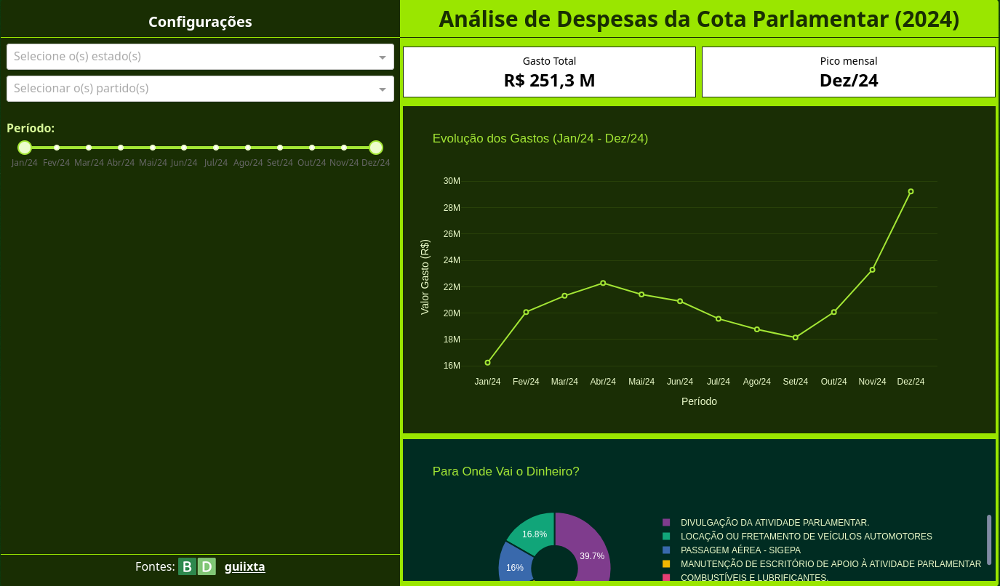

# 🏛️ O Fiscal da Câmara - Dashboard de Despesas Parlamentares

[](https://fiscal-camara-dashboard.vercel.app/)


> Um dashboard interativo para monitoramento e análise dos gastos da Cota para o Exercício da Atividade Parlamentar (CEAP) dos Deputados Federais brasileiros em 2024.

---

## 📸 Preview



---

## 🎯 Sobre o Projeto

Este projeto foi desenvolvido como um desafio técnico de Data Analytics e Engenharia de Software. O objetivo foi criar uma aplicação web capaz de consumir dados públicos, processá-los e apresentá-los de forma intuitiva para o cidadão.

O sistema permite filtrar os gastos por **Estado (UF)**, **Partido** e **Período (Timeline)**, reagindo dinamicamente para responder a perguntas como:
* "Quanto foi gasto no total?"
* "Qual partido tem a maior média de gastos por deputado?"
* "Quem são os deputados que mais gastaram no período?"
* "Para onde vai o dinheiro (Passagens, Divulgação, etc.)?"

---

## 🚀 Tecnologias Utilizadas

* **Linguagem:** [Python](https://www.python.org/)
* **Framework Web:** [Dash](https://dash.plotly.com/) (by Plotly)
* **Manipulação de Dados:** [Pandas](https://pandas.pydata.org/)
* **Visualização:** [Plotly Express](https://plotly.com/python/plotly-express/)
* **Estilização:** [TailwindCSS](https://tailwindcss.com/) (via CDN) e [Bootstrap Icons](https://icons.getbootstrap.com/).
* **Fonte de Dados:** [Base dos Dados](https://basedosdados.org/) (BigQuery).

---

## ⚙️ Funcionalidades Técnicas

* **Filtros Globais:** Utilização de `dcc.Store` para gerenciamento de estado, permitindo que um único filtro (Slider de Tempo, Dropdowns) controle todos os gráficos simultaneamente sem processamento redundante.
* **Design Responsivo:** Layout construído com classes utilitárias do TailwindCSS.
* **KPIs Dinâmicos:** Cards que calculam totais e picos mensais em tempo real.
* **Formatação Brasileira:** Tratamento de moedas (R$) e datas para o padrão PT-BR.

---

## 📦 Como Rodar o Projeto

Pré-requisitos: Ter o [Python](https://www.python.org/downloads/) e o [Git](https://git-scm.com/) instalados.

```bash
# 1. Clone o repositório
git clone [https://github.com/guiixta/fiscalCamara-Dashboard.git](https://github.com/guiixta/fiscalCamara-Dashboard.git)

# 2. Entre na pasta do projeto
cd fiscalCamara-Dashboard

# 3. Crie um ambiente virtual (Recomendado)
python -m venv .venv

# 4. Ative o ambiente virtual
# No Windows:
.venv\Scripts\activate
# No Linux/Mac:
source .venv/bin/activate

# 5. Instale as dependências
pip install dash pandas plotly

# 6. Execute a aplicação
python main.py
```

O dashboard estará disponível no seu navegador em: http://127.0.0.1:8050/

📂 Estrutura do Projeto

fiscalCamara-Dashboard/
│
├── assets/ # Imagens e ícones estáticos
│   ├── basedosdados.png
│   └── preview.png
│
├── main.py              # Código principal da aplicação (Layout + Callbacks)
├── tabelaDespesa.csv    # Base de dados (ou link direto no código)
├── requirements.txt     # Lista de dependências
└── README.md            # Documentação do projeto

📊 Fonte dos Dados

Os dados foram extraídos da tabela br_camara_dados_abertos.cota_parlamentar através da iniciativa Base dos Dados.

    Período Analisado: 2024

    Granularidade: Despesa individual por nota fiscal.

👨‍💻 Autor

Desenvolvido por guiixta.
